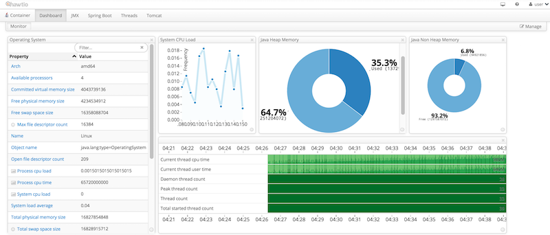
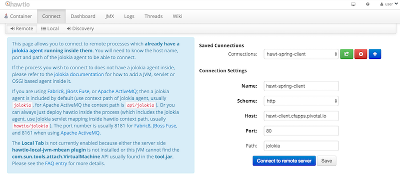

= Hawt.io Spring Boot Lab

*Hawt.io* provides a slick JVM and JMX monitoring service you can deploy into your space

. link:hawtio-spring-client[Hawt.io Spring Client] - Basic Spring Boot client for Hawt.io service 
. link:hawtio-app[Hawt.io App] - presents the UI for the Hawt.io service

It leverages spring cloud services as an example for service discovery too

Hawt.io App and Hawt.io Spring Client is deployable to any Cloud Foundry environment utilizing the service components that have been packaged with the project.
However, it is most easily deployed to Pivotal Cloud Foundry environments that have installed the https://network.pivotal.io/products/p-spring-cloud-services[Spring Cloud Services] package.

== Building

. Using Maven, build and package the application:
+
----
$ cd hawtio-sample-app
$ mvn package
----
+
Maven will automatically download all of the dependencies. This may take a few moments.

== Deploying to Pivotal Cloud Foundry with Spring Cloud Services

. Run `./create_services_pcf.sh` to create the services that you need:
+
----
$ ./create_services_pcf.sh
Creating service service-registry in org microservices / space hawtio-demo as admin...
OK
----
. Click on the *Manage* links for the *Service Registry*. Make sure the service is finished initializing before you proceed.

. Edit the *Client App's* `manifest.yml` file to specify the Cloud Foundry target the apps are being pushed to, replacing the URL in `CF_TARGET: https://api.cf.deepsouthcloud.com` with the API endpoint for your Cloud Foundry deployment.

. Push the apps

+
----
$ cd hawtio-app
$ cf push
$ cd hawtio-spring-client
$ cf push
----
+
This will push the Hawt.io service and client app, binding to the services

== Testing the Applications

. In a browser, access the Hawt.io service application at the route that was created for you at the */hawtio* endpoint:
+

