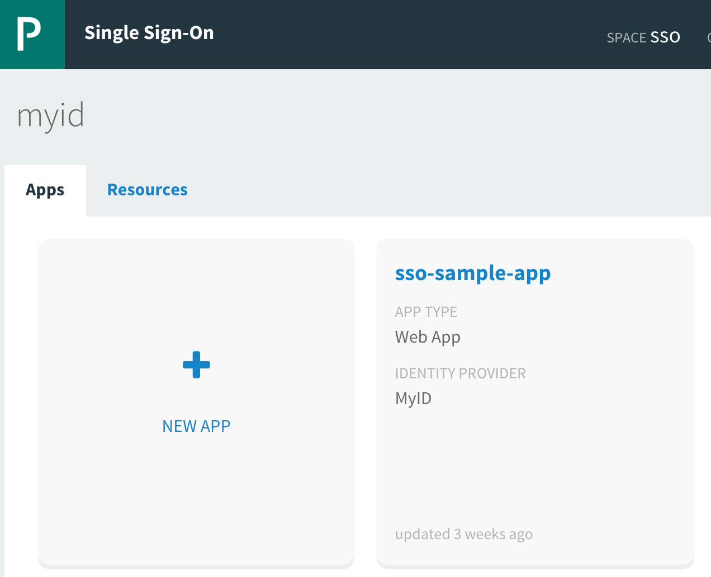
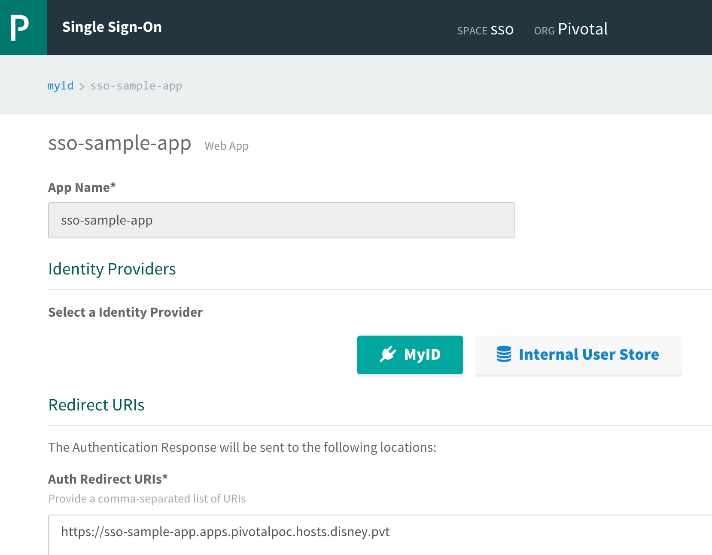

= Pivotal SSO Spring Boot Lab with MyID Integration

This lab is a sample application for the Pivotal Single Sign-On Service.

== Build

. Go to your application directory and push the app.
+
----
$ cd spring-sso-sample-app
$ ./gradlew build
$cf push
----

== Configure the service instance

. Click 'manage' for the provisioned service, you will be presented with a swatch of apps this service has been bound to:
+

. Select the 'MyID' square so it is highlighted in green. Unselect the 'Internal User Store' so it is back to white.
+

. Restage your application
+
----
$ cf restage sso-sample-app
----

. Use an HTTPS request to meet your app and login with your MyID
. You will be presented with the return values from the authentication

