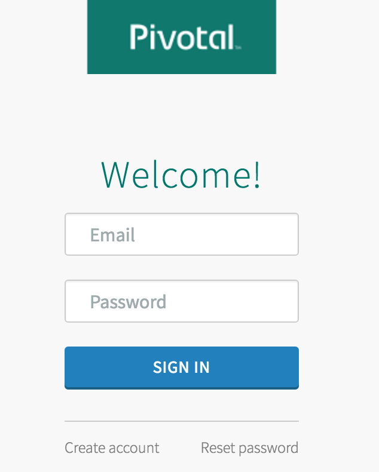
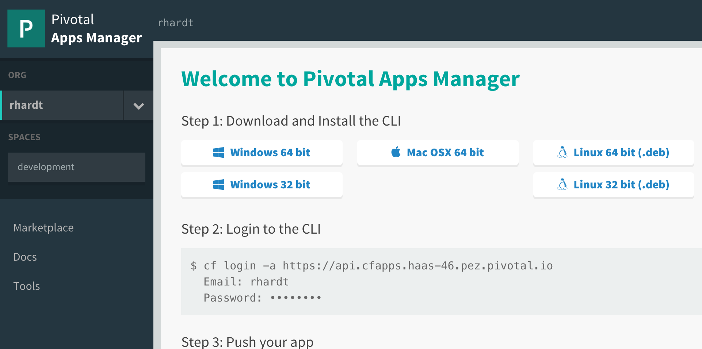

= PCF Environment Access

== Account set up and Pre-work

. You should be able to log in with your foxinc email.  Ben or Rob will provide you the default password.  If your login doesn't work, contact Ben/Rob.

. Navigate in a web browser to https://apps.system.pcf.foxinc.com

. Log in using your account credentials
+

. You should see the apps manager dashboard.
+

== Target the Environment

. If you haven't already, download the latest release of the Cloud Foundry CLI from https://github.com/cloudfoundry/cli/releases for your operating system and install it.

. Set the API target for the CLI: (set appropriate end point for your environment)
+
----
$ cf login -a api.system.pcf.foxinc.com --skip-ssl-validation
----

. Enter the default password or whatever you may have changed it to.

== Apps Manager UI

. An alternative to installing the CF CLI is via your PCF Apps Manager interface.

. Navigate in a web browser to https://apps.system.pcf.foxinc.com

. Login to the interface with your email/password

. Click the 'Tools' link, and download the CLI matching your operating system

. Install the CLI
